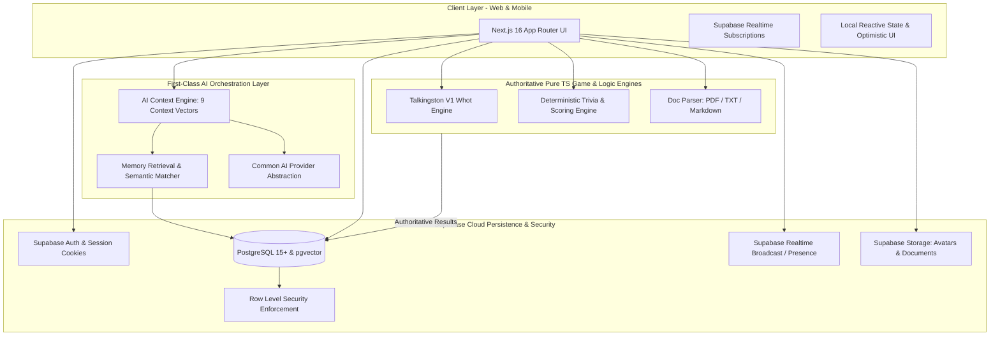
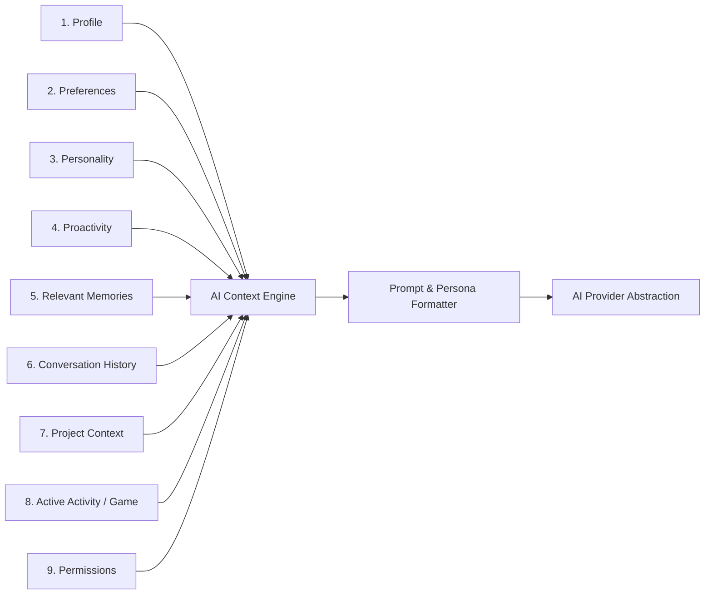

# Talkingston V1 — System Architecture

Pass 6 adds deterministic Trivia and a bounded document-to-quiz pipeline. AI may propose question content, but validation, answer locking, timing, scoring, ranking, room membership, and ownership stay server-authoritative. PDF/TXT/Markdown documents are extracted server-side, capped at 100,000 characters, and stored privately before structured generation.

This document defines the high-level architecture, module boundaries, data flow pipelines, and technical contracts governing Talkingston V1.

---

## 1. System Topology Overview

Talkingston is architected as a modern, reactive full-stack Next.js 16 application with an authoritative Supabase backend (PostgreSQL, pgvector, Auth, Realtime, Storage) and an abstracted AI Orchestration layer.



---

## 2. Deterministic Pure TypeScript Game Engines

A fundamental architectural constraint of Talkingston is:
> **LLMs are NEVER authoritative for deterministic business rules.**
> The AI must never determine legal moves, turns, scores, penalties, or winners.

### 2.1 Talkingston V1 Whot Engine
- **Implementation**: Pure TypeScript (`lib/games/whot/`).
- **Purity**: Zero external side effects, 100% testable state transitions `(State, Action) => NextState`.
- **Validation**:
  - Validates player turns and card legality against the active discard card and called suit.
  - Computes card effects deterministically: Hold On (1), Pick Two (2), Pick Three (5), Suspension (8), General Market (14), Whot (20).
  - Handles defense penalty stacking (e.g. defending a Pick 2 with a Pick 2).
  - Calculates starvation/exhaustion penalties (Star cards value doubled) when the market is depleted.
- **AI Role**:
  - As **Opponent**: AI runs a deterministic heuristic algorithm choosing the highest-utility legal move from its hand.
  - As **Commentator**: AI consumes state transition event logs (e.g. `PLAYER_GENERAL_MARKET`, `DEFENSE_STACK_PLAYED`) to generate banter.
  - As **Referee**: Explains why a move was disallowed or confirms a win, referencing rule IDs.

### 2.2 Deterministic Trivia Engine
- **Implementation**: Pure TypeScript (`lib/games/trivia/`).
- **Scoring Formula**:
  $$\text{Score} = \text{BasePoints} + \left(\frac{\text{TimeRemaining}}{\text{TotalTime}} \times \text{SpeedBonus}\right) \times \text{StreakMultiplier}$$
- **Verification**: Client submits only the selected option index and timestamp; server validates correctness against the stored question hash.

---

## 3. First-Class AI Context Engine & Orchestrator

The **AI Context Engine** is a core architectural component sitting between application features and the AI providers. It assembles context across 9 explicitly separated vectors before any LLM completion is triggered.



### The 9 Context Vectors:

1. **User Profile**:
   - User display name, unique handle, timezone, background notes.
2. **User Preferences & Style**:
   - Communication tone preferences, reading level, language nuances.
3. **Talkingston Personality**:
   - Strictly configured to one of: `Quiet`, `Balanced`, `Friendly`, `Witty`, or `Very Playful`.
4. **Proactivity Level**:
   - Strictly configured to one of: `Off`, `Low`, `Normal`, or `High`. Governs whether the companion initiates follow-ups, checks in, or restricts itself to direct replies.
5. **Relevant Memories**:
   - Extracted semantic facts and user preferences retrieved via `pgvector` cosine similarity ($\le 0.7$ distance) and keyword matching.
6. **Conversation History**:
   - Recent message window (token-budgeted sliding window) preserving immediate conversational continuity.
7. **Project Context**:
   - Active project metadata, associated tasks, notes, and goals when interacting within a project workspace.
8. **Active Activity / Game Context**:
   - Current role and state: Free chat, Whot match commentary, Referee decision explanation, Quizmaster round hosting, or Document tutoring.
9. **Permissions & Privacy Boundaries**:
   - Explicit constraints on what data can be accessed, whether memories can be stored from this session, and user data sharing rules.

---

## 4. Common AI Provider Abstraction

To ensure vendor neutrality and zero application rewrite when switching models, all AI calls go through a universal interface:

```typescript
export interface AiMessage {
  role: 'system' | 'user' | 'assistant';
  content: string;
}

export interface AiCompletionOptions {
  temperature?: number;
  maxTokens?: number;
  stream?: boolean;
}

export interface AiProvider {
  name: string;
  generateText(messages: AiMessage[], options?: AiCompletionOptions): Promise<string>;
  streamText(messages: AiMessage[], options?: AiCompletionOptions): AsyncIterable<string>;
  generateStructured<T>(messages: AiMessage[], schema: any): Promise<T>;
}
```

### Adapters Supported:
- **Google Gemini Adapter**: Native support for Gemini models.
- **Anthropic Claude Adapter**: Support for Claude 3.5 Sonnet / Haiku.
- **OpenAI Adapter**: Support for GPT-4o / GPT-4o-mini.
- **Deterministic Test / Mock Adapter**: Fast, deterministic local mock provider for unit tests and zero-API-key offline development.

---

## 5. Persistence & Security Architecture (Supabase First)

Talkingston utilizes **Supabase** as its sole, authoritative persistence layer:
1. **PostgreSQL Database**: Authoritative relational data store with foreign keys, checks, and unique constraints.
2. **pgvector Extension**: Powers semantic similarity search for companion memories (`vector(768)` or `vector(1536)`).
3. **Row Level Security (RLS)**: Every single table enforces RLS. Client requests authenticate via JWT tokens.
4. **Supabase Realtime**: Powers low-latency card moves in Whot, multiplayer quiz rooms, and 1-on-1 direct messaging.
5. **Supabase Storage**: Secure buckets for user avatars and uploaded study documents (PDF, TXT, MD) with private access policies.

### 5.1 Implemented Client & Server Connection Layer (Stage 2A)
The core connection infrastructure is established without tables or migrations:
- **Browser Client** (`lib/supabase/client.ts`): SSR-safe browser client using `@supabase/ssr` (`createBrowserClient`), restricted strictly to `NEXT_PUBLIC_SUPABASE_URL` and `NEXT_PUBLIC_SUPABASE_ANON_KEY`.
- **Server Client** (`lib/supabase/server.ts`): App Router client using `@supabase/ssr` (`createServerClient`) coupled with Next.js `cookies()` storage for authenticated sessions.
- **Admin Client** (`lib/supabase/admin.ts`): Server-only client with `SUPABASE_SERVICE_ROLE_KEY` guarded by runtime browser checks (`typeof window !== 'undefined'`).
- **Middleware Session Refresher** (`lib/supabase/middleware.ts`): Minimal technical utility for refreshing auth session tokens without product authorization logic.
*(Note: Database tables and SQL migrations are intentionally deferred to Stage 2B).*

### 5.2 Pass 1 Application Surfaces

Pass 1 provides the responsive application shell and initial authenticated product surfaces:

- App Router routes for authentication, onboarding, home, projects, games, friends, and settings.
- Supabase SSR session refresh through middleware and server-side `auth.getUser()` checks for protected layouts.
- Server actions for validated profile and companion-settings writes. These actions derive the user ID from the verified session and write only to the documented `profiles` and `companion_settings` tables.
- Client components handle loading, inline error, success, empty, and unauthorized states without exposing service-role credentials.

Projects, games, social features, AI chat, memory, notifications, and automation remain intentionally out of scope for Pass 1.

### 5.3 Pass 2 AI Companion

Pass 2 adds a provider-neutral AI layer under `lib/ai/providers/` with Gemini, Anthropic, OpenAI, and deterministic mock adapters. Provider credentials are read only in server-side code. `lib/ai/context/` assembles exactly nine bounded context vectors before a provider call: profile, preferences, personality, proactivity, relevant memories, conversation history, project context, active activity/game context, and permissions.

The chat API persists conversations and messages through the documented Supabase tables, verifies ownership with the authenticated session, streams provider output as SSE, and extracts only explicit useful facts/preferences/goals into `user_memories`. Keyword retrieval is used as the fallback when vector search is unavailable. No external tools are enabled in Pass 2.

### 5.4 Pass 3 Routing, History, and Projects

Pass 3 adds `lib/ai/router/`, which selects one configured provider per request in configurable order (`AI_PROVIDER_ORDER`, default Gemini → Anthropic → OpenAI → Mock). Retryable rate-limit and temporary-unavailable errors move to the next candidate; non-retryable errors stop routing. Lightweight process-local health tracks successful requests, consecutive failures, and cooldowns to avoid retry storms.

Conversation history is paginated and searchable through owner-scoped Supabase queries. Projects use the documented `projects` table, associate through `conversations.project_id`, and are passed to the existing nine-vector context engine only when the active conversation belongs to that project.

### 5.5 Pass 4 Social Hub

Pass 4 adds server-authorized social route handlers under `app/api/users`, `app/api/friends`, `app/api/messages/direct`, and `app/api/groups`. User discovery returns only public profile fields and uses bounded, authenticated search. Friendship state is persisted in `friendships`, while direct and group messages use the documented `direct_messages` and `group_messages` tables.

Client social views subscribe to Supabase Realtime Postgres insert events using the existing browser client. Subscriptions are removed on unmount, and message IDs are de-duplicated when an optimistic response and realtime event both arrive. Group access is checked through `group_members` before metadata, membership, or messages are returned.

The Pass 4 migration is the source of truth for social persistence and RLS. A dedicated DM inbox aggregates recent participant-scoped messages server-side. Presence is intentionally not enabled: no durable or authorized presence contract existed in the current schema, so the UI does not display fabricated online status.

---

## 6. Document-to-Quiz Pipeline

The V1 document ingestion pipeline processes study materials deterministically:
1. **File Upload**: Handled via secure server action/API route validating MIME types and size ($\le 10\text{MB}$).
2. **Parsing**:
   - **Markdown / TXT**: UTF-8 stream normalization.
   - **PDF**: Document text extraction via stream parser.
   - *(DOCX is intentionally deferred from V1).*
3. **Chunking & Summarization**: Text split into semantic segments.
4. **Quiz Generation**: AI Provider generates structured multiple-choice questions validated via Zod schemas.
5. **Storage**: Verified questions stored in PostgreSQL for solo practice or live quiz rooms.

Whot follows the same boundary: pure TypeScript validates and mutates game state, API routes authorize the room member and persist versioned state, and Supabase Realtime distributes persisted events. AI commentary or opponent heuristics may only consume engine-approved events and legal moves.
