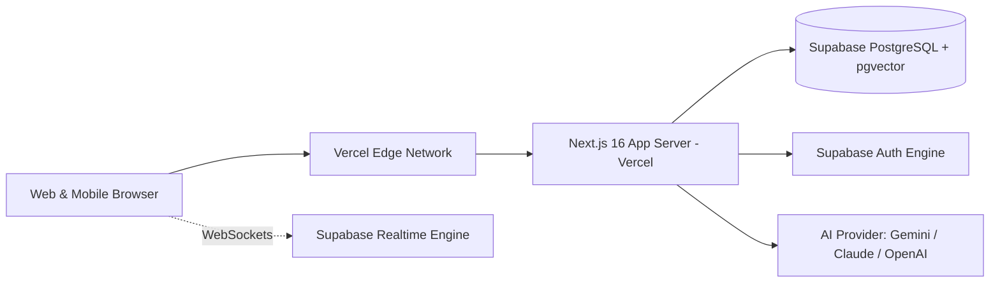

# Talkingston V1 — Deployment Guide & Operational Runbook

This document details the deployment architecture, configuration steps, database migrations, and operations protocol for hosting Talkingston on Vercel and Supabase.

---

## 1. Hosting Architecture



---

## 2. Environment Variables Configuration

### 2.1 Vercel Production Environment Settings
Set the following environment variables in the Vercel Project Dashboard:

```env
# App URL
NEXT_PUBLIC_APP_URL=https://talkingston.vercel.app

# Supabase Configuration
NEXT_PUBLIC_SUPABASE_URL=https://your-project.supabase.co
NEXT_PUBLIC_SUPABASE_ANON_KEY=eyJhbGciOiJIUzI1...
SUPABASE_SERVICE_ROLE_KEY=eyJhbGciOiJIUzI1...

# AI Provider Configuration
AI_PROVIDER=gemini
GEMINI_API_KEY=AIzaSy...
ANTHROPIC_API_KEY=sk-ant-...
OPENAI_API_KEY=sk-...
```

### 2.2 Local Environment Setup (Stage 2A)
For local development and testing, create `.env.local` (which is excluded from Git):
```env
NEXT_PUBLIC_APP_URL=http://localhost:3000
NEXT_PUBLIC_SUPABASE_URL=https://your-project-ref.supabase.co
NEXT_PUBLIC_SUPABASE_ANON_KEY=your-anon-public-key
SUPABASE_SERVICE_ROLE_KEY=your-service-role-server-key
AI_PROVIDER=mock
```

---

## 3. Database Migration Runbook (Deferred to Stage 2B)

### 3.1 Initial Setup on Supabase
1. Create a new Supabase project.
2. In the Supabase SQL Editor, verify extensions:
   ```sql
   CREATE EXTENSION IF NOT EXISTS "uuid-ossp";
   CREATE EXTENSION IF NOT EXISTS "vector";
   CREATE EXTENSION IF NOT EXISTS "pg_trgm";
   ```
3. Run the migrations in order:
   - `supabase/migrations/20260913210000_pass4_social.sql`
   - `supabase/migrations/20260914100000_pass5_whot.sql`
   - `supabase/migrations/20260914113000_pass6_trivia_documents.sql`
   - `supabase/migrations/20260914121500_pass5_whot_lifecycle.sql`
   - `supabase/migrations/20260914130000_pass7_productivity.sql`
   - `supabase/migrations/20260914140000_recover_pass1_3_schema.sql`

### 3.2 Realtime Publication Setup
Enable Realtime replication on the following tables in Supabase:
```sql
ALTER PUBLICATION supabase_realtime ADD TABLE public.whot_events;
ALTER PUBLICATION supabase_realtime ADD TABLE public.direct_messages;
ALTER PUBLICATION supabase_realtime ADD TABLE public.group_messages;
ALTER PUBLICATION supabase_realtime ADD TABLE public.trivia_rooms;
ALTER PUBLICATION supabase_realtime ADD TABLE public.trivia_answers;
ALTER PUBLICATION supabase_realtime ADD TABLE public.notifications;
```

---

## 4. Verification & Health Check

1. Run the production smoke test against the deployed app: load `/login`, authenticate, and open a protected route such as `/home`.
2. Check Supabase connection and vector extension availability.
3. Test Realtime WebSocket connection from the browser console and verify the required publication tables are enabled.
4. Verify that non-authenticated requests to private tables are blocked by RLS.

Talkingston does not currently expose a dedicated `/api/health` route.
